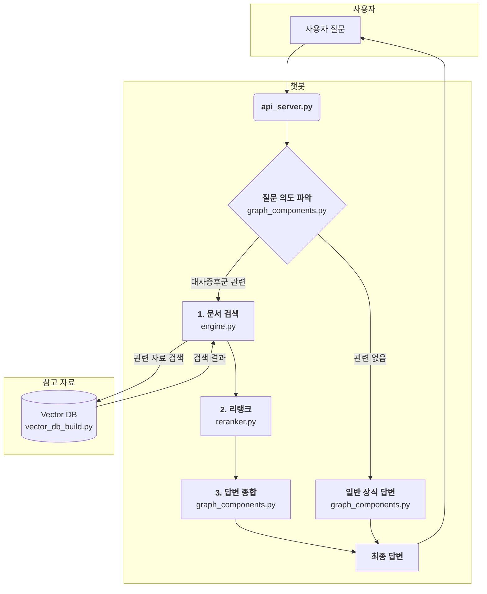

# 📌 대사증후군 전문상담사(신입) 지원 챗봇

**보건소에서 근무하는 대사증후군 전문상담사 신입분**들을 위한 RAG 기반 챗봇입니다.  

## 프로젝트 목표
- **문서 기반 답변**: LLM의 환각(hallucination)을 최소화  
- **지식 확장**: 사전에 학습되지 않은 데이터베이스의 정보를 검색 및 활용  
- **실제 현장 적용**: 상담사가 대사증후군 정보를 빠르고, 쉽게 얻을 수 있도록 지원  

## 주요 기능
- **상담 챗봇**: 상담 Q&A 보조, 대사증후군 관련 정보 제공  
- **Vector DB 구축**: 대사증후군 문서 기반 데이터베이스  
- **Advanced RAG**: 검색 → 리랭킹(선택) → LLM 추론 파이프라인  
- **Backend API 서버**: 외부 시스템과 연동 가능한 REST API

## LLM
본 프로젝트에서 사용되는 모델은 아래와 같습니다:

- **임베딩 모델**: `nlpai-lab/KURE-v1`
- **리랭커(선택)**: `Qwen/Qwen3-Reranker-0.6B`
- **답변 생성(추론)**: `gpt-4o`  
- **질문 분류기**: `gpt-5-nano`

## 테스트 환경
- CPU: AMD Ryzen 7 5800U
- GPU: NVIDIA RTX 3060 6GB Laptop
- RAM: DDR4 16GB
- OS: Ubuntu 22.04 LTS
- Python: 3.11.11

## 설치

```
sudo apt-get update && apt-get upgrade -y
```

```
# API Code
git clone https://github.com/pakyeon/rag-metabolic-syndrome-chatbot.git
```

```
cd rag-metabolic-syndrome-chatbot
```

```
# VectorDB Data files
# TODO: 추후 하위 레포 또는 통합 예정
git clone https://github.com/pakyeon/metabolic_syndrome_data.git
```

```
pip install -r requirements.txt
```

```
sudo vim .env

# 필수
# OPENAI_API_KEY="sk-..."

# 선택
# RAG_LLM_MODEL="gpt-4o" : 답변(추론) 모델
# RAG_EMBED_MODEL="nlpai-lab/KURE-v1" : 임베딩 모델
# DETECT_LLM_MODEL="gpt-5-nano" : 질문 분류 모델
# RAG_LLM_TEMPERATURE=0.2 : 답변(추론) 모델 temperature 값
# RAG_TOP_K=5 : 모델에게 입력되는 문서의 개수
# RAG_RERANK_TOP_K=20 : 리랭커 모델에게 입력되는 문서의 개수
# RAG_USE_RERANK=0 : 0 or 1 , 0일 경우 리랭커 모델 사용 x
```

```
source .env
```

## Open-WebUI를 통한 사용 방법 예시

```
python vector_db_build.py
```

```
python api_server.py
```

```
docker run -d -p 3000:8080 -v open-webui:/app/backend/data --name open-webui ghcr.io/open-webui/open-webui:main
```

```
# Open-WebUI 시작

브라우저에서 "http://localhost:3000/"을 입력하여 Open-WebUI에 접속

이후 계정 생성(첫 번째 계정은 관리자 계정)
```

```
# API 엔드포인트 연결

1. 좌측 하단 사용자 이름 > 관리자 패널

2. 설정 > 연결 > OpenAI API 연결 관리

3. ➕ 연결 추가

4. API URL: https://

5. 연결 편집

연결 방식: 외부
API URL: http://host.docker.internal:8910/v1 (또는 특정 공급자의 URL)
API 키: 자유롭게 입력
모델 IDs: rag-gpt

저장하고 아래 "직접 연결" 토글 활성화 (Open-WebUI 버전별로 다를 수 있음)
```

```
모델 선택 후 쿼리 입력
```

## 시스템 흐름도

