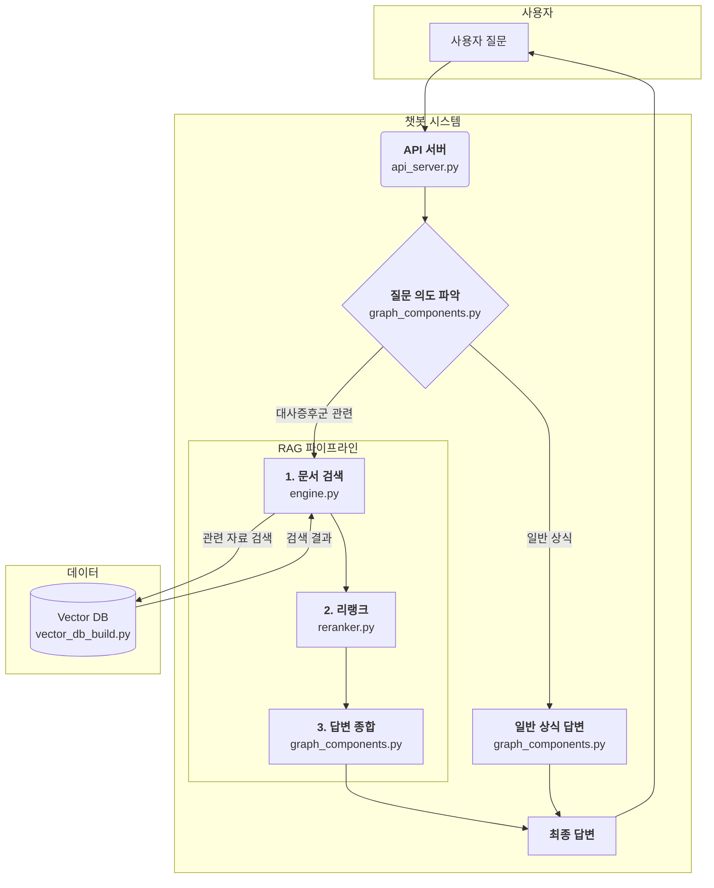

# 📌 대사증후군 전문 상담 RAG 챗봇

**보건소에서 근무하는 대사증후군 전문상담사(신입)** 분들을 위한 RAG(검색 증강 생성) 기반 챗봇입니다. LLM의 환각(Hallucination)을 최소화하고, 최신 정보를 바탕으로 정확하고 신뢰도 높은 답변을 제공하는 것을 목표로 합니다.

---

## 목차

- [주요 특징](#-주요-특징)
- [시스템 아키텍처](#-시스템-아키텍처)
- [시작하기](#-시작하기)
  - [사전 요구사항](#-사전-요구사항)
  - [설치 및 실행](#-설치-및-실행)
- [사용 방법](#-사용-방법)
  - [API 직접 호출 (cURL)](#-api-직접-호출-curl)
  - [Open-WebUI 연동](#-open-webui-연동)
- [프로젝트 구조](#-프로젝트-구조)
- [환경 변수 설정](#-환경-변수-설정)
- [라이선스](#-라이선스)

---

## ✨ 주요 특징

- **📄 문서 기반 답변**: LLM의 환각(Hallucination)을 최소화하고 신뢰성 있는 정보 제공
- **🧠 지식 확장성**: 사전 학습되지 않은 최신 데이터베이스의 정보를 검색 및 활용
- **🚀 실제 현장 적용**: 상담사가 대사증후군 정보를 빠르고, 쉽게 얻을 수 있도록 지원
- **🔗 Advanced RAG**: `검색` → `리랭킹` → `LLM 추론` 파이프라인으로 답변 정확도 향상
- **🔌 OpenAI 호환 API**: `Open-WebUI` 등 다양한 외부 시스템과 쉽게 연동 가능한 REST API 제공

---

## 🏗️ 시스템 아키텍처

본 챗봇은 사용자의 질문 의도를 파악하여, 대사증후군 관련 질문일 경우 RAG 파이프라인을 통해 답변을 생성하고, 일반 상식 질문일 경우 LLM이 직접 답변합니다.



### 사용 모델
- **Embedding Model**: `nlpai-lab/KURE-v1`
- **Reranker Model**: `Qwen/Qwen3-Reranker-0.6B` (선택 사항)
- **Generator (Inference)**: `gpt-4o`
- **Classifier**: `gpt-5-nano`

---

## 🚀 시작하기

### 사전 요구사항
- Python 3.10+
- Git
- Docker (Open-WebUI 연동 시)

### 설치 및 실행

1. **프로젝트 클론**
   ```bash
   # API 코드
   git clone https://github.com/pakyeon/rag-metabolic-syndrome-chatbot.git
   cd rag-metabolic-syndrome-chatbot

   # VectorDB에 사용될 데이터 파일
   # git submodule로 통합 예정
   git clone https://github.com/pakyeon/metabolic_syndrome_data.git
   ```

2. **필요 패키지 설치**
   ```bash
   pip install -r requirements.txt
   ```

3. **환경 변수 설정**
   `.env` 파일을 생성하고 아래 내용을 복사하여 채워넣습니다.
   ```bash
   # .env 파일 예시
   # 필수
   OPENAI_API_KEY="sk-..."

   # 선택
   RAG_LLM_MODEL="gpt-4o"
   RAG_EMBED_MODEL="nlpai-lab/KURE-v1"
   DETECT_LLM_MODEL="gpt-5-nano"
   RAG_LLM_TEMPERATURE=0.2
   RAG_TOP_K=5
   RAG_RERANK_TOP_K=20
   RAG_USE_RERANK=0 # 0: 사용 안함, 1: 사용
   ```

4. **VectorDB 데이터 구축**
   `metabolic_syndrome_data` 폴더의 문서를 기반으로 VectorDB를 생성합니다.
   ```bash
   python vector_db_build.py
   ```

5. **API 서버 실행**
   ```bash
   python api_server.py
   ```
   서버가 `http://localhost:8910`에서 실행됩니다.

---

## 📖 사용 방법

### API 직접 호출 (cURL)
서버가 실행된 후, `curl`을 사용하여 API를 직접 테스트할 수 있습니다.

```bash
curl http://localhost:8910/v1/chat/completions \
  -H "Content-Type: application/json" \
  -d '{
    "model": "rag-gpt",
    "messages": [
      {
        "role": "user",
        "content": "대사증후군 진단 기준은 무엇인가요?"
      }
    ]
  }'
```

### Open-WebUI 연동
Docker를 사용하여 Open-WebUI를 설치하고 API 서버를 연동할 수 있습니다.

1. **Open-WebUI 실행**
   ```bash
   docker run -d -p 3000:8080 --add-host=host.docker.internal:host-gateway -v open-webui:/app/backend/data --name open-webui ghcr.io/open-webui/open-webui:main
   ```

2. **Open-WebUI 설정**
   - 브라우저에서 `http://localhost:3000` 접속 후 계정 생성
   - `설정` > `연결` > `OpenAI API`
   - **API URL**: `http://host.docker.internal:8910/v1`
   - **API Key**: 아무 값이나 입력 (예: `sk-1234`)
   - **Model IDs**: `rag-gpt` 입력 후 저장

3. **챗봇 사용**
   - Open-WebUI 메인 화면에서 `rag-gpt` 모델을 선택하고 질문을 입력합니다.

---

## 📁 프로젝트 구조
```
.
├── api_server.py         # FastAPI 기반 API 서버
├── engine.py             # RAG 핵심 로직 (검색, 답변 생성)
├── graph_components.py   # RAG 파이프라인(그래프) 구성 요소
├── vector_db_build.py    # VectorDB 생성 및 관리
├── reranker.py           # Reranker 모델 로직
├── config.py             # 프로젝트 설정 (환경변수 등)
├── utils.py              # 유틸리티 함수
├── api_models.py         # API 요청/응답 모델
├── requirements.txt      # Python 패키지 의존성
└── metabolic_syndrome_data/ # 원본 데이터 디렉토리
```

---

## ⚙️ 환경 변수 설정

| 변수명                  | 기능                                       | 기본값                  | 필수 | 
| ----------------------- | ------------------------------------------ | ----------------------- | ---- | 
| `OPENAI_API_KEY`        | OpenAI API 키                              | -                       | **예** | 
| `RAG_LLM_MODEL`         | 답변 생성(추론)에 사용할 LLM 모델          | `gpt-4o`                | 아니오 | 
| `RAG_EMBED_MODEL`       | 임베딩에 사용할 모델                       | `nlpai-lab/KURE-v1`     | 아니오 | 
| `DETECT_LLM_MODEL`      | 질문 분류에 사용할 LLM 모델                | `gpt-5-nano`           | 아니오 | 
| `RAG_LLM_TEMPERATURE`   | 생성 모델의 Temperature 값 (창의성 조절)   | `0.2`                   | 아니오 | 
| `RAG_TOP_K`             | LLM에 입력으로 제공할 검색된 문서의 수     | `5`                     | 아니오 | 
| `RAG_RERANK_TOP_K`      | 리랭커 모델에 입력할 검색된 문서의 수      | `20`                    | 아니오 | 
| `RAG_USE_RERANK`        | 리랭커 사용 여부 (`1`: 사용, `0`: 미사용)  | `0`                     | 아니오 | 

---