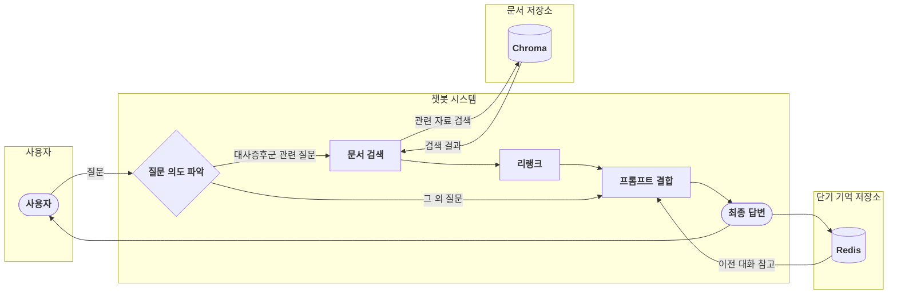

# 📌 대사증후군 전문 상담 RAG 챗봇

**보건소에서 근무하는 대사증후군 전문상담사(신입)** 분들을 위한 RAG(검색 증강 생성) 기반 챗봇입니다. LLM의 환각(Hallucination)을 최소화하고, 최신 정보를 바탕으로 정확하고 신뢰도 높은 답변을 제공하는 것을 목표로 합니다.

---

## 목차

- [주요 특징](#주요-특징)
- [시스템 아키텍처](#시스템-아키텍처)
- [시작하기](#시작하기)
  - [사전 요구사항](#사전-요구사항)
  - [설치 및 실행](#설치-및-실행)
- [사용 방법](#사용-방법)
  - [API 직접 호출](#api-직접-호출)
  - [Open-WebUI 연동](#open-webui-연동)
- [프로젝트 구조](#프로젝트-구조)
- [환경 변수 설정](#환경-변수-설정)

---

## 주요 특징

- **📄 문서 기반 답변**: LLM의 환각(Hallucination)을 최소화하고 신뢰성 있는 정보 제공
- **🧠 지식 확장성**: 사전 학습되지 않은 최신 데이터베이스의 정보를 검색 및 활용
- **💬 대화 기억 기능**: Redis 기반 단기 기억으로 자연스러운 다중 턴 대화 지원
- **🚀 실제 현장 적용**: 상담사가 대사증후군 정보를 빠르고, 쉽게 얻을 수 있도록 지원
- **🔗 Advanced RAG**: `검색` → `리랭킹` → `LLM 추론` 파이프라인으로 답변 정확도 향상
- **🔌 OpenAI 호환 API**: `Open-WebUI` 등 다양한 외부 시스템과 쉽게 연동 가능한 REST API 제공

---

## 시스템 아키텍처

본 챗봇은 사용자의 질문 의도를 파악하여, 대사증후군 관련 질문일 경우 RAG 파이프라인을 통해 답변을 생성하고, 일반 상식 질문일 경우 LLM이 직접 답변합니다. Redis를 통한 대화 기억 기능으로 연속된 대화의 맥락을 유지합니다.



### 사용 모델
- **Embedding Model**: `nlpai-lab/KURE-v1`
- **Reranker Model**: `Qwen/Qwen3-Reranker-0.6B` (선택 사항)
- **Generator (Inference)**: `gpt-4o`
- **Classifier**: `gpt-5-nano` (차후 변경 예정)
- **Memory Storage**: `Redis` (대화 기억)

---

## 시작하기

### 사전 요구사항
- Python 3.10+
- Git
- Docker (Redis 및 Open-WebUI 연동 시)

### 설치 및 실행

1. **프로젝트 클론**
   ```bash
   # 프로젝트와 데이터(submodule) 함께 클론
   git clone --recurse-submodules https://github.com/pakyeon/rag-metabolic-syndrome-chatbot.git
   cd rag-metabolic-syndrome-chatbot
   ```

2. **필요 패키지 설치**
   ```bash
   pip install -r requirements.txt
   ```

3. **환경 변수 설정**
   `.env` 파일을 생성하고 아래 내용을 복사하여 채워넣습니다.
   ```bash
   # .env 파일 예시
   # 필수
   OPENAI_API_KEY="sk-..."

   # RAG 설정 (선택)
   RAG_LLM_MODEL="gpt-4o"
   RAG_EMBED_MODEL="nlpai-lab/KURE-v1"
   DETECT_LLM_MODEL="gpt-5-nano"
   RAG_LLM_TEMPERATURE=0.2
   RAG_TOP_K=5
   RAG_USE_RERANK=0 # 0: 사용 안함, 1: 사용

   # Redis 설정 (선택)
   REDIS_HOST=localhost
   REDIS_PORT=6379
   REDIS_PASSWORD=
   REDIS_TTL_HOURS=1
   ```

4. **VectorDB 데이터 구축**
   `metabolic_syndrome_data` 폴더의 문서를 기반으로 VectorDB를 생성합니다.
   ```bash
   python run.py build-db
   ```

5. **Redis 서버 실행**
   ```bash
   # Docker를 사용한 Redis 실행
   docker run -d -p 6379:6379 --name redis-memory redis:alpine
   ```

6. **API 서버 실행**
서버가 `http://localhost:8910`에서 실행됩니다.
   ```bash
   python run.py server
   ```

---

## 사용 방법

### API 직접 호출
서버가 실행된 후, `curl`을 사용하여 API를 직접 테스트할 수 있습니다.

#### 기본 질문
```bash
curl http://localhost:8910/v1/chat/completions \
  -H "Content-Type: application/json" \
  -d '{
    "model": "rag-gpt",
    "messages": [
      {
        "role": "user",
        "content": "대사증후군 진단 기준은 무엇인가요?"
      }
    ]
  }'
```

#### 대화 기억을 활용한 연속 질문

```bash
# 첫 번째 질문
curl http://localhost:8910/v1/chat/completions \
  -H "Content-Type: application/json" \
  -d '{
    "model": "rag-gpt",
    "messages": [{"role": "user", "content": "대사증후군이 무엇인가요?"}],
    "user_id": "user123",
    "conversation_id": "conv456"
  }'

# 두 번째 질문 (이전 대화 기억함)
curl http://localhost:8910/v1/chat/completions \
  -H "Content-Type: application/json" \
  -d '{
    "model": "rag-gpt", 
    "messages": [{"role": "user", "content": "그럼 예방법은 무엇인가요?"}],
    "user_id": "user123",
    "conversation_id": "conv456"
  }'
```

#### 메모리 관리 API
```bash
# 대화 기록 조회
curl http://localhost:8910/api/memory/user123/conv456

# 대화 기록 삭제
curl -X DELETE http://localhost:8910/api/memory/user123/conv456

# 시스템 상태 확인 (Redis 연결 상태 포함)
curl http://localhost:8910/api/status
```

### Open-WebUI 연동
Docker를 사용하여 Open-WebUI를 설치하고 API 서버를 연동할 수 있습니다.

1. **Open-WebUI 실행**
   ```bash
   docker run -d -p 3000:8080 --add-host=host.docker.internal:host-gateway -v open-webui:/app/backend/data --name open-webui ghcr.io/open-webui/open-webui:main
   ```

2. **Open-WebUI 설정**
   - 브라우저에서 `http://localhost:3000` 접속 후 계정 생성
   - `설정` > `연결` > `OpenAI API`
   - **API URL**: `http://host.docker.internal:8910/v1`
   - **API Key**: 아무 값이나 입력 (예: `sk-1234`)
   - **Model IDs**: `rag-gpt` 입력 후 저장

3. **챗봇 사용**
   - Open-WebUI 메인 화면에서 `rag-gpt` 모델을 선택하고 질문을 입력합니다.
   - **대화 기억**: Open-WebUI에서 자동으로 사용자별/대화별 세션을 관리하므로, 연속된 대화가 자연스럽게 이어집니다.

---

## 프로젝트 구조
```
.
├── run.py                     # 통합 실행 스크립트 (서버, DB빌드)
├── src
│   ├── api
│   │   ├── server.py          # FastAPI 기반 API 서버
│   │   └── schema.py          # API 요청/응답 모델
│   ├── core
│   │   ├── engine.py          # RAG 핵심 로직 (LangGraph)
│   │   ├── graph_components.py# RAG 파이프라인(그래프) 구성 요소
│   │   └── reranker.py        # Reranker 모델 로직
│   ├── storage
│   │   ├── memory.py          # Redis 기반 대화 메모리 관리
│   │   └── vector_db.py       # VectorDB 생성 및 관리
│   ├── config.py              # 프로젝트 설정 (환경변수 등)
│   └── utils.py               # 유틸리티 함수
├── requirements.txt           # Python 패키지 의존성
└── metabolic_syndrome_data/   # 대사증후군 문서 디렉토리 (Git Submodule)
```

---

## 환경 변수 설정

### 필수 설정
| 변수명                  | 기능                                       | 기본값                  | 필수 |
| ----------------------- | ------------------------------------------ | ----------------------- | ---- |
| `OPENAI_API_KEY`        | OpenAI API 키                              | -                       | **예** |

### RAG 엔진 설정
| 변수명                  | 기능                                       | 기본값                  | 필수 |
| ----------------------- | ------------------------------------------ | ----------------------- | ---- |
| `RAG_LLM_MODEL`         | 답변 생성(추론)에 사용할 LLM 모델          | `gpt-4o`                | 아니오 |
| `RAG_EMBED_MODEL`       | 임베딩에 사용할 모델                       | `nlpai-lab/KURE-v1`     | 아니오 |
| `DETECT_LLM_MODEL`      | 질문 분류에 사용할 LLM 모델                | `gpt-5-nano`           | 아니오 |
| `RAG_LLM_TEMPERATURE`   | 생성 모델의 Temperature 값 (창의성 조절)   | `0.2`                   | 아니오 |
| `RAG_TOP_K`             | LLM에 입력으로 제공할 검색된 문서의 수     | `5`                     | 아니오 |
| `RAG_USE_RERANK`        | 리랭커 사용 여부 (`1`: 사용, `0`: 미사용)  | `0`                     | 아니오 |

### Redis 메모리 설정
| 변수명                  | 기능                                       | 기본값                  | 필수 |
| ----------------------- | ------------------------------------------ | ----------------------- | ---- |
| `REDIS_HOST`            | Redis 서버 호스트                          | `localhost`             | 아니오 |
| `REDIS_PORT`            | Redis 서버 포트                            | `6379`                  | 아니오 |
| `REDIS_PASSWORD`        | Redis 인증 비밀번호                        | (없음)                  | 아니오 |
| `REDIS_TTL_HOURS`       | 대화 기록 유지 시간 (시간)                 | `1`                     | 아니오 |

---

## 대화 메모리 기능

### 특징
- **자동 세션 관리**: Open-WebUI에서 자동 생성되는 사용자/대화 ID 활용
- **단기 기억**: 최근 5개 메시지 쌍 유지 (사용자 5개 + 어시스턴트 5개)
- **자동 만료**: 설정된 TTL 시간(기본 1시간) 후 자동 삭제
- **컨텍스트 연결**: RAG 답변과 일반 답변 모두에서 이전 대화 참고

### 동작 방식
1. **메시지 저장**: 사용자 질문과 어시스턴트 답변을 Redis에 자동 저장
2. **히스토리 조회**: 답변 생성 시 해당 대화의 이전 메시지들을 참조
3. **자연스러운 연결**: "그것은 무엇인가요?" 같은 대명사 참조 질문도 이해
4. **메모리 관리**: API를 통한 대화 기록 조회/삭제 기능

---
